# First steps

## Intro Labs

### Auth-Code Demo

We could setup local Keycloak based on docker.
The demo showed us the [RFC 7517](https://tools.ietf.org/html/rfc7517), how the user goes through the different stages
from client to the auth-provider, getting a authentication-token, back to the client, requesting the access-token,
where we were able to call our backend-system.

```
     +----------+
     | Resource |
     |   Owner  |
     |          |
     +----------+
          ^
          |
         (B)
     +----|-----+          Client Identifier      +---------------+
     |         -+----(A)-- & Redirection URI ---->|               |
     |  User-   |                                 | Authorization |
     |  Agent  -+----(B)-- User authenticates --->|     Server    |
     |          |                                 |               |
     |         -+----(C)-- Authorization Code ---<|               |
     +-|----|---+                                 +---------------+
       |    |                                         ^      v
      (A)  (C)                                        |      |
       |    |                                         |      |
       ^    v                                         |      |
     +---------+                                      |      |
     |         |>---(D)-- Authorization Code ---------'      |
     |  Client |          & Redirection URI                  |
     |         |                                             |
     |         |<---(E)----- Access Token -------------------'
     +---------+       (w/ Optional Refresh Token)
```

### Github Client

In this exercise, we could authenticate by our Github-Account.
We created in the github-account of our organization a new OAuth-App.
Then we placed the generated client-id and client-secret in to to
application.yaml.
Then, we tried to enhance the list of available Authentication-Providers with
the gitlab account.

0. Login into GitHub and select "Settings":<br/>
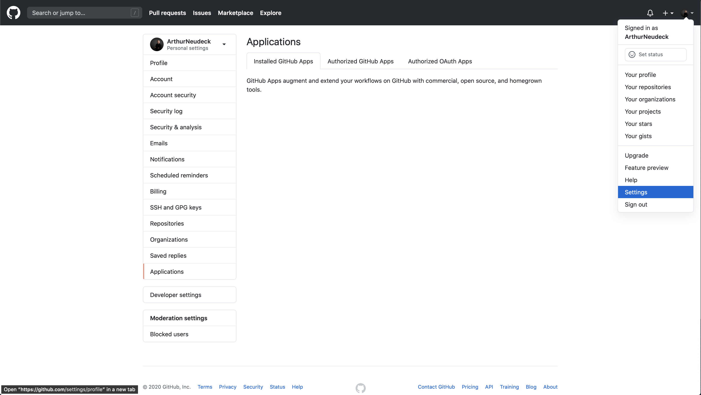
0. Next choose "Developer Settings":<br/>
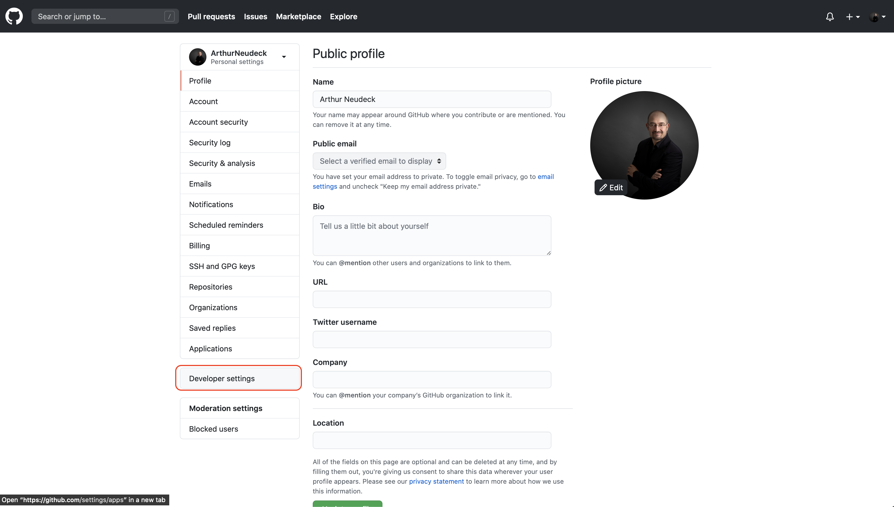
0. Register a new OAuth Apps:<br/>
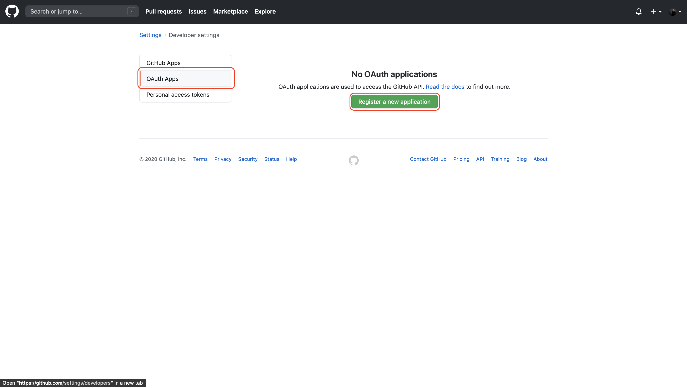
0. Define all details for the new OAuth App:<br/>
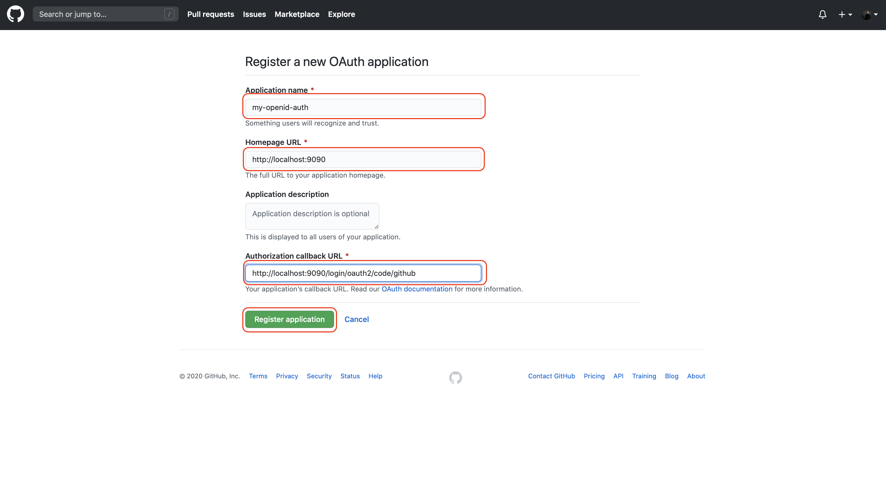
0. As a result your client-id and credential should be visible:<br/>
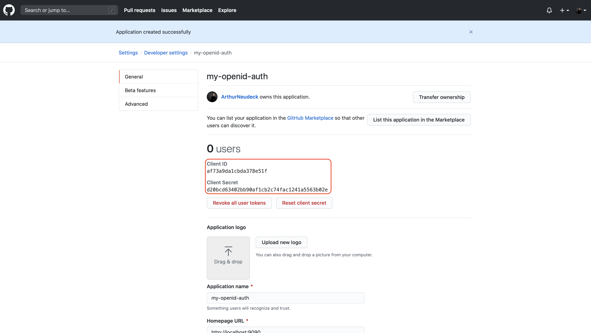
0. Add both to your application.xml in IntelliJ:<br/>
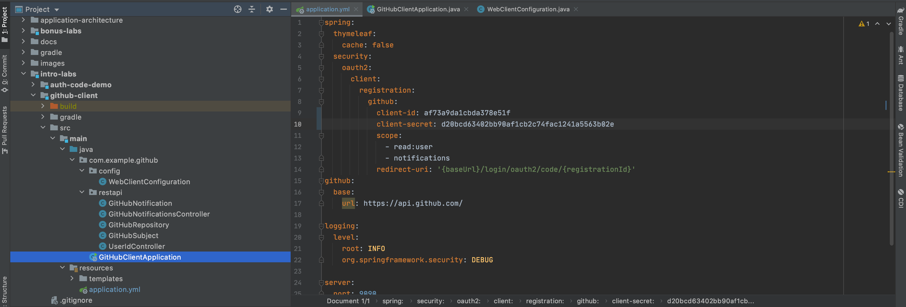
0. Start your client application in the intro-lab for github-client:<br/>
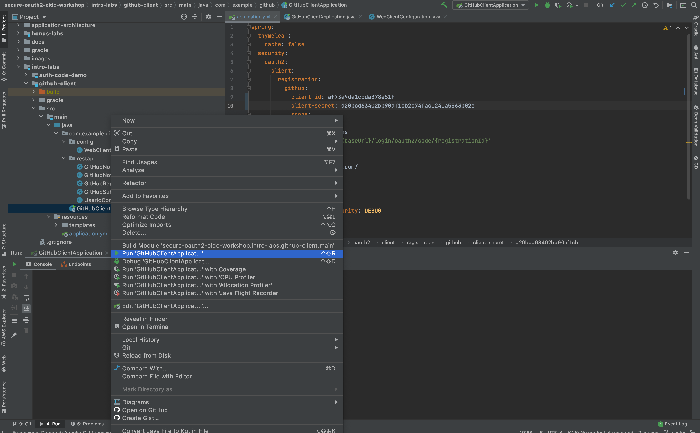
0. Log-in into GitHub as you are asked next:<br/>
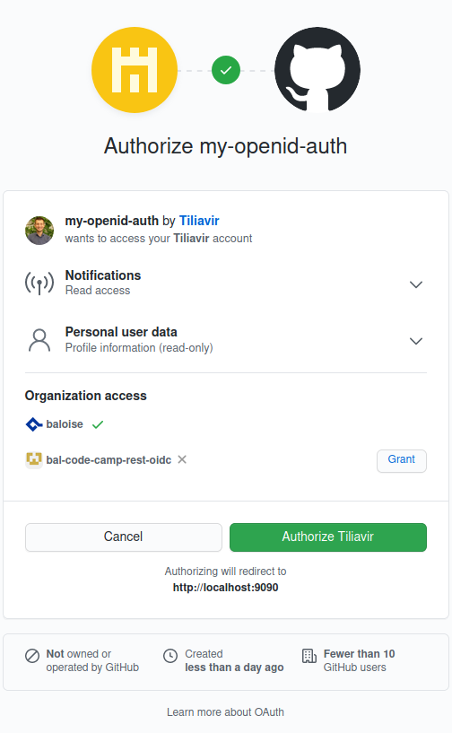
0. Finally you should see all attributes as follows:<br/>
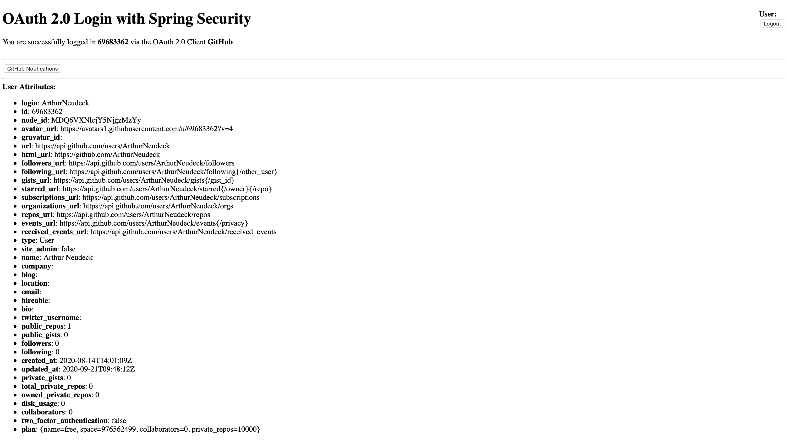

## Lab 1

### Implement an OAuth2/OIDC resource server

Spring Security maps these scopes to the Spring Security authorities `SCOPE_library_admin`, `SCOPE_email` and
`SCOPE_profile` by default.  
@PreAuthorize("hasRole('LIBRARY_ADMIN') || hasAuthority('SCOPE_library_admin')")
Discussion about @PreAuthorize vs @Secured or @RolesAllowed as described at
[Baeldung](https://www.baeldung.com/spring-security-method-security)

### Customize Aud(ience) Mapping
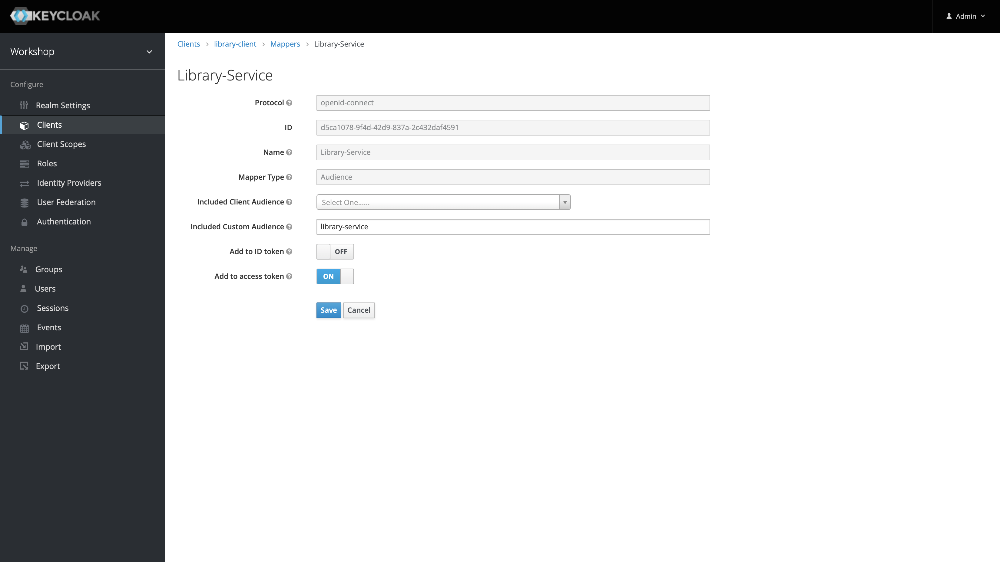

## Lab 2

### Provide Correct Logout
In Lab 2 we had a special task: we wanted to implement logout properly, so that we 
sign-off using keycloak. The commits describing the code changes in the oidc tutorial
can be found at https://github.com/bal-code-camp-rest-oidc/secure-oauth2-oidc-workshop/commit/08fd4fe572f0b881fa575e01d375da11edd4909b.

Additionally we have to ensure that our redirect URL in the code is a valid redirect URL:
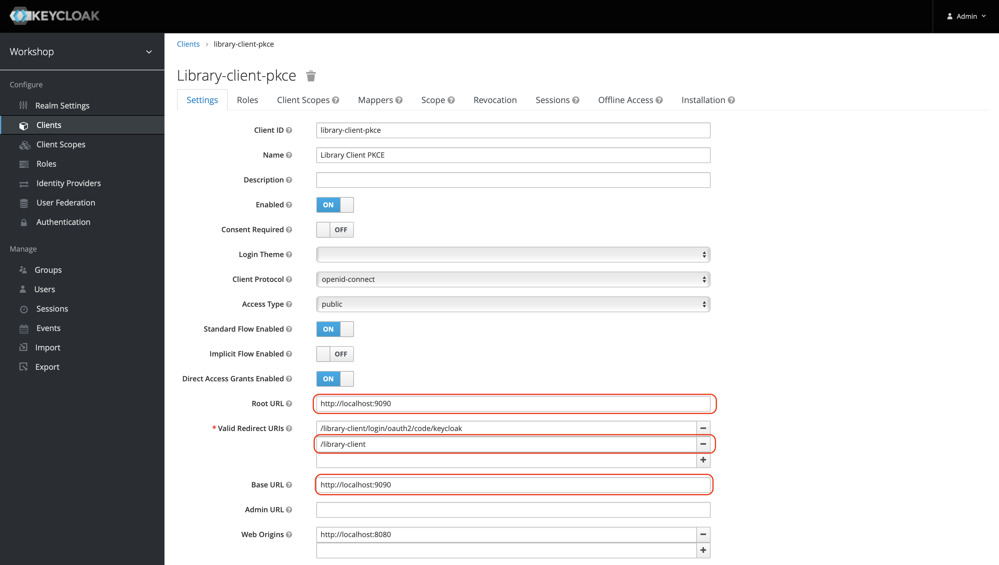
### Glossary

[JWK](https://tools.ietf.org/html/rfc7517)
