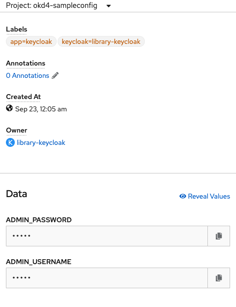

# Third Day, 23.09.2020

On this day we had only half of a day as we planned a social event (hiking, spa, beer)
in the afternoon. Therefore we also started seperating us into two teams:
- Keycloak Admin API
- Extended Docker Image
- build and delpoyment on Openshift 

## Keycloak Admin API
One team was interested in using a Java API to access keycloak
from an admin perspective: this should help us requesting users and roles
as well as creating clinets, roles, groups etc. for self-service tasks.

## Extended Docker Image
Also on this third day we worked on the docker image.

## Keycloak Operator Openshift

To install the operator you need to go to the operator -> operator hub section in the openshift console
(https://console-openshift-console.apps.okd.baloise.dev). There you will find a keycloak operator.


After installing it your operator is ready to install keycloak servers in given namespaces.

You can install the following components:


We start with installing a keycloak instance:


A good point to start with sample configurations is on the [github operator repository](https://github.com/keycloak/keycloak-operator/tree/master/deploy/examples). You can copy the examples for an easy start.

We end up with the following yaml configuration:
```yaml
apiVersion: keycloak.org/v1alpha1
kind: Keycloak
metadata:
  name: example-keycloak
  labels:
    app: sso
  namespace: okd4-sampleconfig
spec:
  externalAccess:
    enabled: true
  instances: 1
```

## First Login With Autogenerated Password

Open the console of OpenShift and navigate to `secrets/credential-library-keycloak`. There is the admin secret available. You can reveal it and use it directly for admin login.



## Issues

### Openshift Restarts Keycloak During Pod-Startup

Because of the default resources for the keycloak container, the liveness and readiness probes failed on startup. For this reason we needed to increase the deployment resources.

So we added the following request resources:
```yaml
...
spec:
  ...
  keycloakDeploymentSpec:
    resources:
      requests:
        cpu: "1"
        memory: 2Gi
```

### Non-Automated Configuration Over OpenShift-UI

We preferred the gitops-way and added the initial `keycloak.yaml`
in our gitops repository `okd4-appconfig`. This way, the complete
Keycloak setup was specified and synced by ArgoCD.