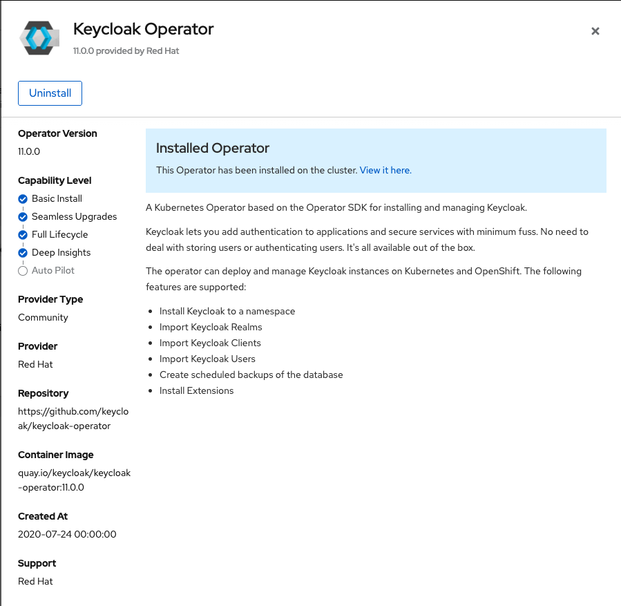
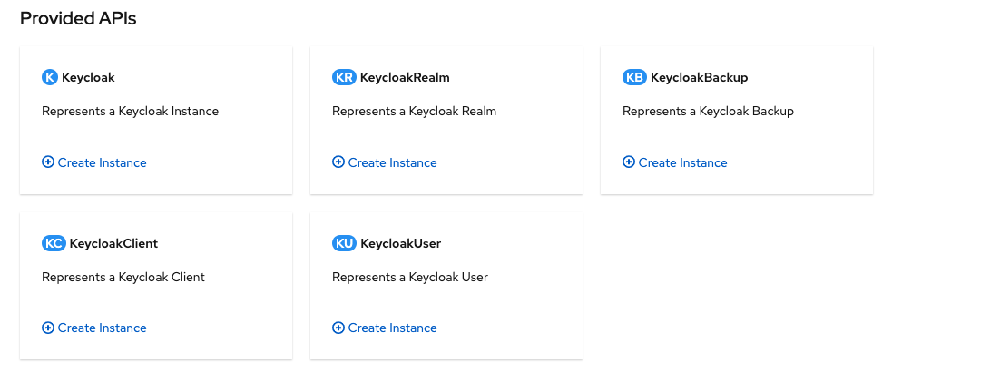
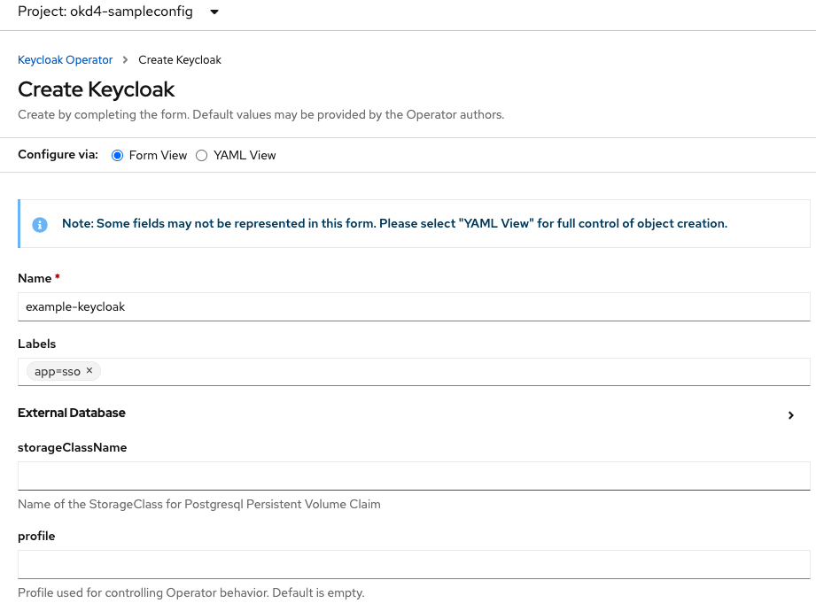

# Third day

## Keycloak Operator Openshift

To install the operator you need to go to the operator -> operator hub section in the openshift console. There you will find a keycloak operator.



After installing it your operator is ready to install keycloak servers in given namespaces.

You can install the following components:


We start with installing a keycloak instance:


We end up with the following yaml configuration:
```yaml
apiVersion: keycloak.org/v1alpha1
kind: Keycloak
metadata:
  name: example-keycloak
  labels:
    app: sso
  namespace: okd4-sampleconfig
spec:
  externalAccess:
    enabled: true
  instances: 1
```

## Issues

### Openshift restarts Keycloak during pod-startup

Because of the default resources for the keycloak container, the liveness and readiness probes failed on startup. For this reason we needed to increase the deployment resources.

So we added the following request resources:
```yaml
...
spec:
  ...
  keycloakDeploymentSpec:
    resources:
      requests:
        cpu: "1"
        memory: 2Gi
```

### Non-automated configuration over OpenShift UI

We preferred the gitops-way and added the initial `keycloak.yaml`
in our gitops repository `okd4-appconfig`. This way, the complete
Keycloak setup was specified and synced by ArgoCD.