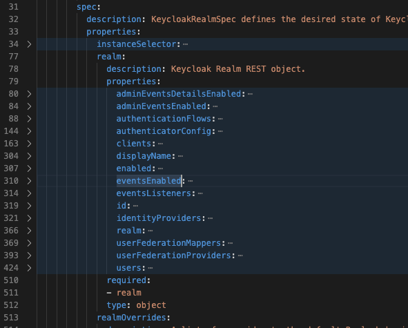

# Fourth day


## Keycloak Realm Openshift
The realm configuration of keycloak operator is limited. The following configurations are available:



We tried to convert the given keycloak-json-configuration to yaml with the [Json2Yaml](https://www.json2yaml.com/).

We could not use it for our purpose, as we should also configure realm specific
roles, which are not supported.

Another solution to import config would be to use the  [keycloak-cli](https://github.com/adorsys/keycloak-config-cli) until the complete configuration is available on operator.

For this reason we imported the configuration through json import.

## Conclusion

For our CodeCamp, we stopped to configure the realm by gitops/scirpt-based, and
imported the given realm-config from the workshop through the KeyCloak UI Import-Feature.


## Provide dockerized images

### Github Actions
We wanted to build an image to deploy our library server to openshift. To do this we decided to use the new github actions instead of travis. To build the image we decided to use native [gradle bootBuildImage task](https://spring.io/guides/gs/spring-boot-docker/). To enable the right docker image name we need to add the following lines to build.gradle:
```gradle
bootBuildImage{
    imageName='luechtdiode/oidc-ws-library-server'
}
```

We searched for an action that pushes the builded image only. All available
Github-Actions in the Marketplace managed both (build & push) in one atomic step.

Our soultion now is motivated by [www.prestonlamb.com/blog](https://www.prestonlamb.com/blog/creating-a-docker-image-with-github-actions), where all plain docker-commands are scripted straight forward as Github-Action-Steps.

### Env Variables
To pass keycloak parameters to our new docker image, we substituted our hard-coded values with environment variables. 

```yaml
spring:
  ...
  security:
    oauth2:
      resourceserver:
        jwt:
          jwk-set-uri: ${JWK_SET_URI}
          issuer-uri: ${ISSUER_URI}
```

After that change we are able to parametrize our keycloak uris from the openshift-instance, starting the local dockerized server-instance to test
the new substituted env-variables:

```bash
docker run \
    --rm -p 9091:9091 \
    -e JWK_SET_URI=https://keycloak-okd4-sampleconfig.apps.okd.baloise.dev/auth/realms/workshop/protocol/openid-connect/certs \
    -e ISSUER_URI=https://keycloak-okd4-sampleconfig.apps.okd.baloise.dev/auth/ \
    realms/workshop docker.io/luechtdiode/oidc-ws-library-server:latest

```
We could use the postman-testcases to authenticate on keykloak in openshift (getting the access-token) and calling the rest-api in the dockerized backend-server.

The same tasks we applied to the library-client implementation of lab2.

### Completed Image builds available via docker.io

After the Github-Actions finished successfully, the built images are pushed into our docker.io repo [luechtdiode/oidc-ws-library-server](https://hub.docker.com/repository/docker/luechtdiode/oidc-ws-library-server) and [luechtdiode/oidc-ws-library-client](https://hub.docker.com/repository/docker/luechtdiode/oidc-ws-library-client).

## Deploy via ArgoCD

The deployment in OpenShift is made by gitops, managed by [ArgoCd](https://argocd.baloise.dev/applications/okd4-sampleconfig?operation=false).
Our gitops-repo is located at [okd4-sampleconfig](https://github.com/bal-code-camp-rest-oidc/okd4-appconfig/tree/master/okd4-sampleconfig).

In our Chart/Values yamls, we added two new Applications:
1. library-server
2. library-client

### New Helm-Chart Dependencies
```yaml
...
dependencies:
...
  - name: generic-chart
    version: 2.0.0
    repository: https://registry.baloise.dev/chartrepo/library
    alias: library-server
  - name: generic-chart
    version: 2.0.0
    repository: https://registry.baloise.dev/chartrepo/library
    alias: library-client
```

### Library-Server

The Server provides its endpoint as service and also as public [Server Entrypoint-URL](https://bvcc2020-library-server.apps.baloise.dev/library-server).
It has configured the urls to integrate the keycloak, deployed in the same
OpenShift-Namespace.

```yaml
library-server:
  image:
    repository: luechtdiode/oidc-ws-library-server
    tag: d2df9d37b50ae7d37727417938b11fde5b7d8745
  replicaCount: 1
  network:
    http:
      servicePort: 9091
      ingress:
        host: bvcc2020-library-server.apps.baloise.dev
  env:
  - name: JWK_SET_URI
    value: https://keycloak-okd4-sampleconfig.apps.okd.baloise.dev/auth/realms/workshop/protocol/openid-connect/certs
  - name: ISSUER_URI
    value: https://keycloak-okd4-sampleconfig.apps.okd.baloise.dev/auth/realms/workshop
```

### Library-Client

The Client provides its endpoint as public [Client Entrypoint-URL](https://bvcc2020-library-client.apps.baloise.dev/library-client/).
It has configured the urls to integrate the keycloak and backend-server, deployed in the same OpenShift-Namespace. The backend-server is routed directly via service instead of routed via the OpenShift Loadbalancer.

```yaml
library-client:
  image:
    repository: luechtdiode/oidc-ws-library-client
    tag: a021cc8ed987705ff38c78ea14b54c316d8c9aad
  replicaCount: 1
  network:
    http:
      servicePort: 9090
      ingress:
        host: bvcc2020-library-client.apps.baloise.dev
  env:
  - name: CLIENT_ID
    value: library-client-pkce
  - name: ISSUER_URI
    value: https://keycloak-okd4-sampleconfig.apps.okd.baloise.dev/auth/realms/workshop
  - name: SERVER_URL
    value: http://library-server:9091/library-server
```