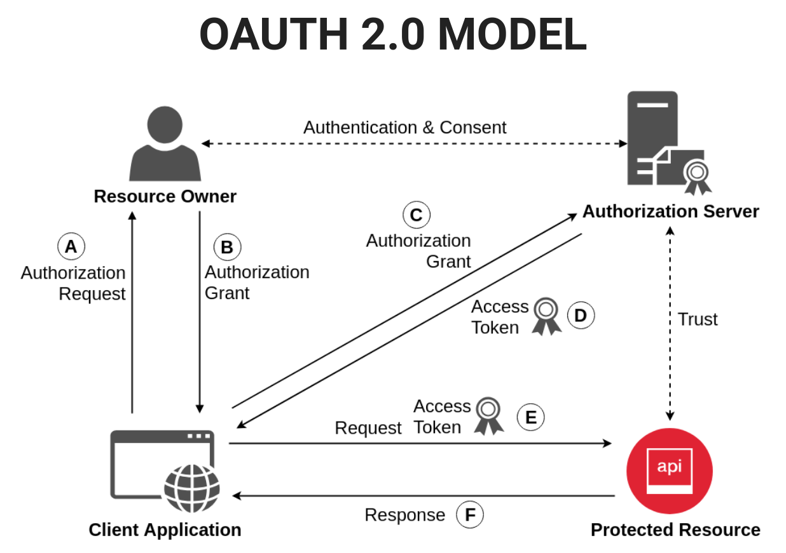

# OAUTH 2.0 and OIDC
## OAUTH 2.0
OAuth 2.0 is the industry-standard protocol for authorization. OAuth 2.0 focuses on client developer simplicity while
 providing specific authorization flows for web applications, desktop applications, mobile phones, and living room 
 devices. This specification and its extensions are being developed within the IETF OAuth Working Group. 

## OIDC
OpenID Connect is a simple identity layer on top of the OAuth 2.0 protocol, which allows computing clients to verify
the identity of an end-user based on the authentication performed by an authorization server, as well as to obtain
basic profile information about the end-user in an interoperable and REST-like manner. In technical terms, OpenID
Connect specifies a RESTful HTTP API, using JSON as a data format.  

OpenID Connect allows a range of kinds of clients, including Web-based, mobile, and JavaScript clients, to request and 
receive information about authenticated sessions and end-users. The specification suite is extensible, supporting
optional features such as encryption of identity data, discovery of OpenID Providers, and session management.

### Additions to OAuth 2.0 
- Id Token (JWT format) 
- User Info Endpoint  
- OpenID Provider Configuration Information 
