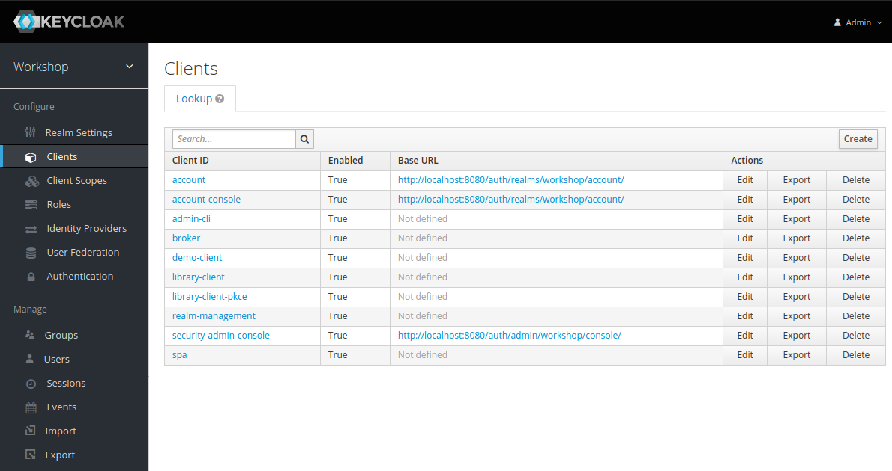
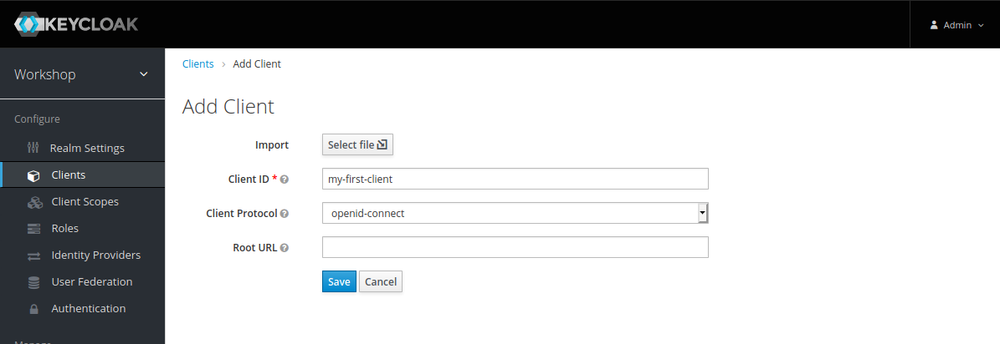
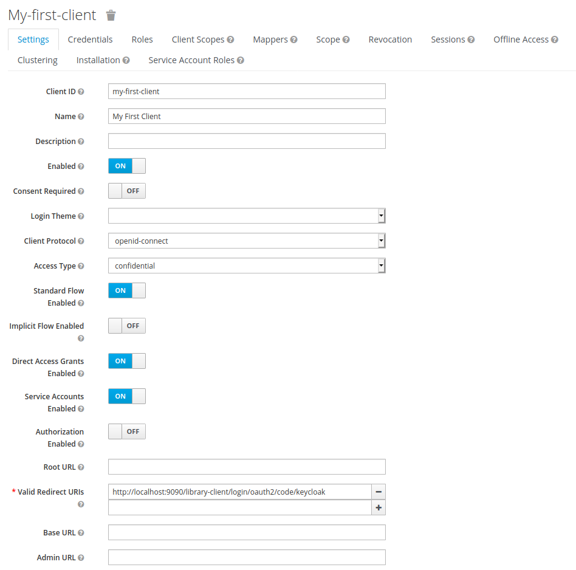
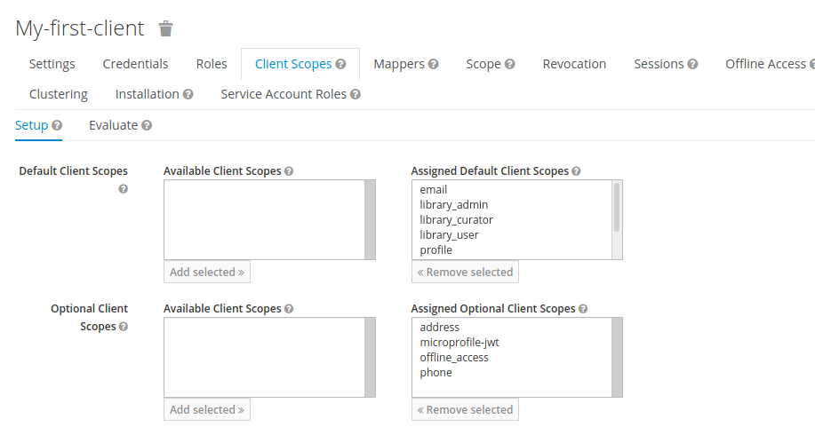
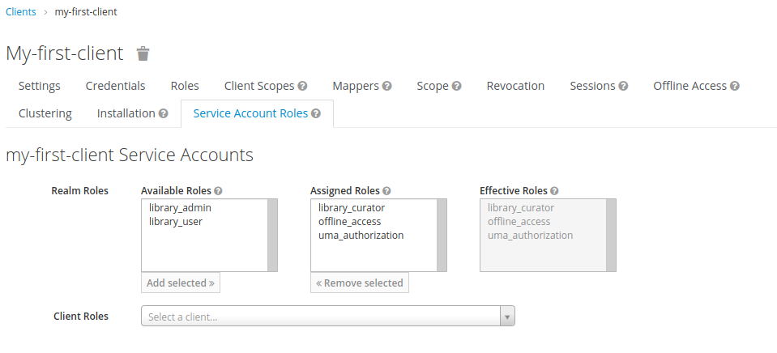
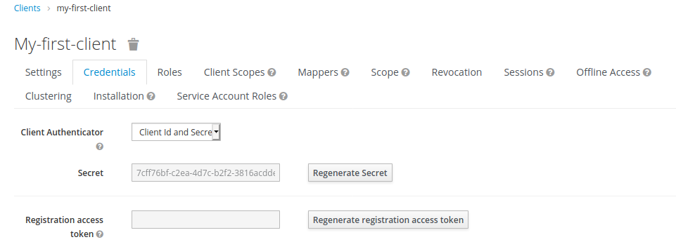
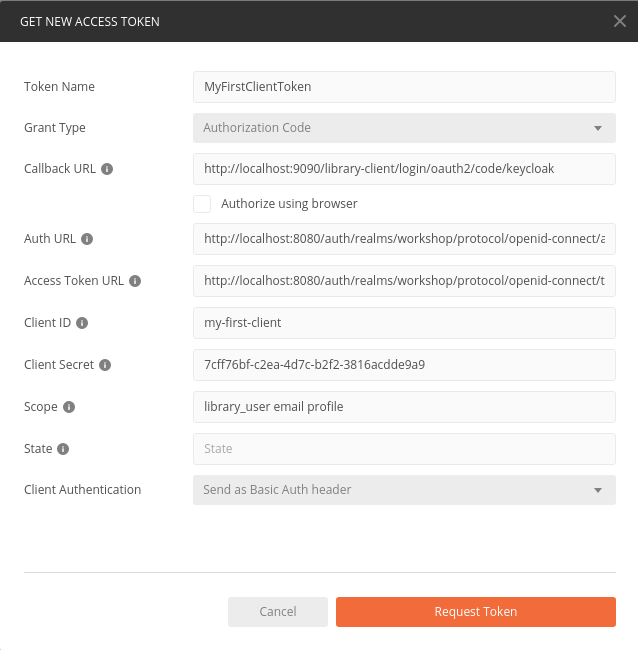
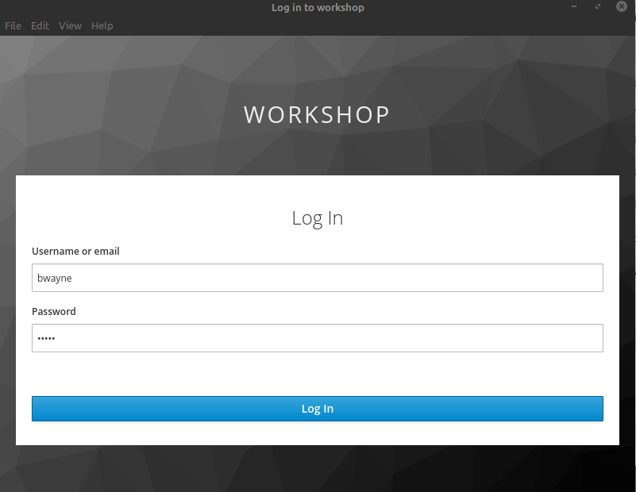
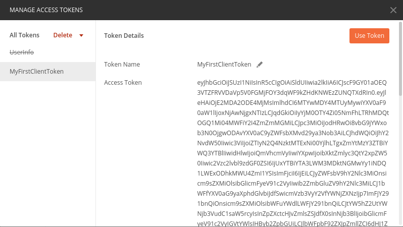

# Adminstrating Keycloak

## Creating New Client
0. Goto http://localhost:8080/ and use "Administration Console"
0. Login using credentials "admin/admin"
0. Click on "Clients" and press "Create": add all parameters as specified below (use "library-client" as template) 

0. Set further configuration parameters as shown below. 

0. Provide all "Client Scopes" 

0. Modify "Library Account Roles" as follows 

0. Copy your client secret for later use in postman 

0. Execute post man with following settings 
 
Explanation for the [state parameter](https://auth0.com/docs/protocols/state-parameters#csrf-attacks).
0. login as user "bwayne/wayne" 

0. Et voila - here is you first own client access. 

