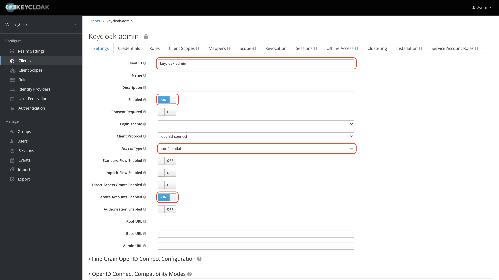
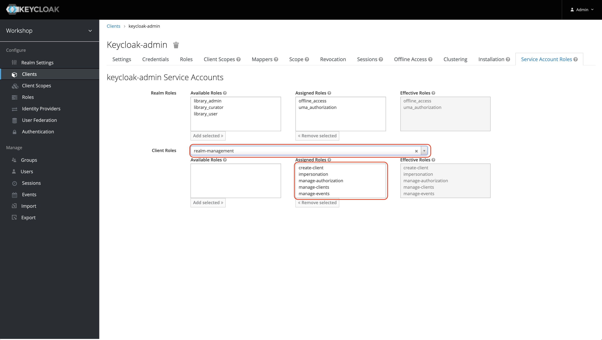
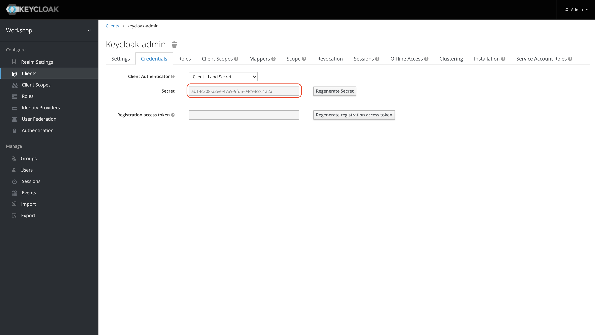

# Admin Client API

## Setup Keycloak Client
0. In a first step you will have to create a **new client**.
   Make sure that it is "enabled" and "confidential" to have credentials as well as that "Service Account Enabled" is set to "On".


0. The next step is that you assign the appropriate **service account roles**.
   Select "realm-management" as "Client Roles", afterwards decide what roles (or better: functionality) your client will be able to use.


0. Finally take the **client credentials** to access this realm:


## Define Dependencies
Keycloak provides the opportunity to access the server using REST. For easier use in Java an
admin API client library exists. You can use it adding the following dependency
to your ```build.gradle```:
```
dependencies {
    [...]
    compile group: 'org.keycloak', name: 'keycloak-admin-client', version: '11.0.2'
    [...]
}
```

## Requesting Data

To access the keycloak server you will have to provide the following code:
```
Keycloak keycloak = KeycloakBuilder.builder()
    .serverUrl("http://localhost:8080/auth")
    .realm("workshop")
    .grantType(OAuth2Constants.CLIENT_CREDENTIALS)
    .clientId("keycloak-admin")
    .clientSecret(***)
    .build();
```
Afterwards you might access some data using this facade:
```
    RealmResource realmResource = keycloak.realm("workshop");
    UsersResource usersResource = realmResource.users();
    for (UserRepresentation currentUser : usersResource.search(emailAddress, offset, maxAmount)) {
        //do something
    }
```
## Bibliographie
- https://keycloak.discourse.group/t/keycloak-admin-client-in-spring-boot/2547