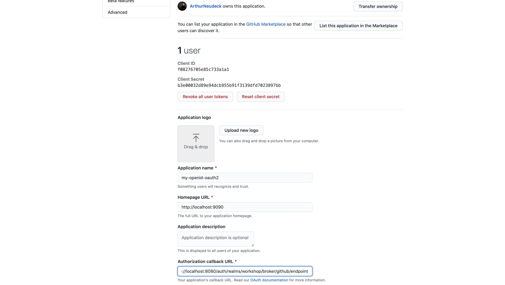
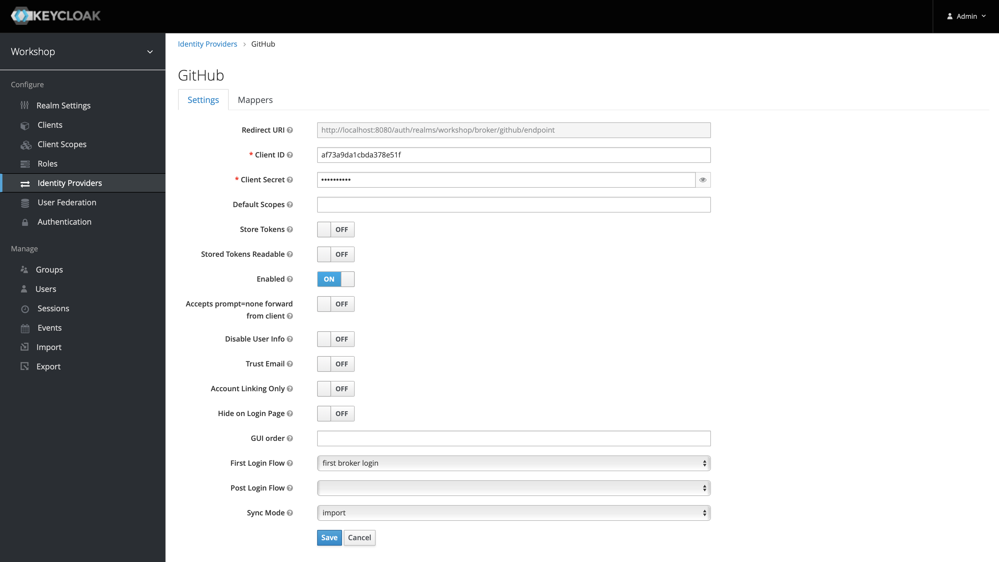
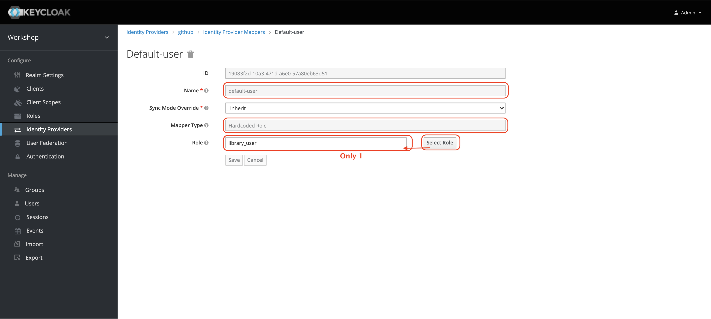
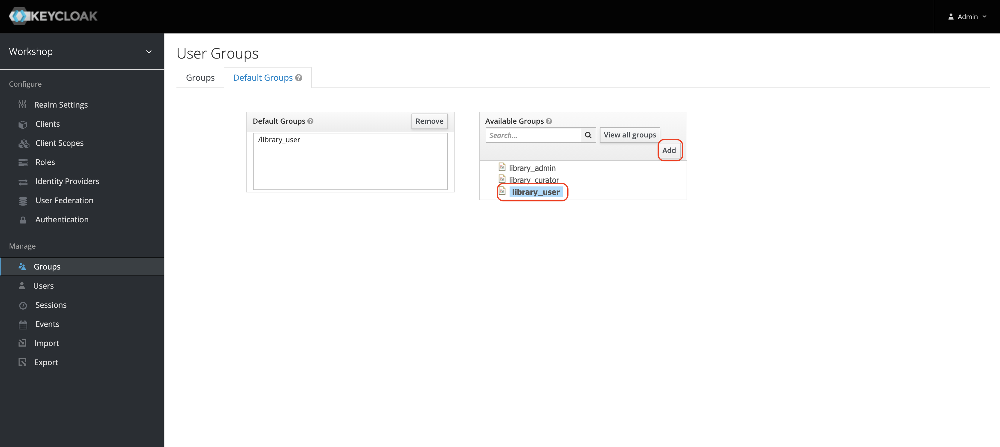

# Adding Identity Providers
0. Lookup credentials in Github: 

0. Create new identity provider in Keycloak in your realm and set credentials: 

0. Assign a default, hard coded role within your identity provider in keycloak: 

0. Finally ensure that a default group will be set in Keycloak for new users: 

