# Add User Federation

## Requirements

The docker compose file `oidc-application-client/docker-compose-setup/docker-compose.yml` starts up all you need:
- OIDC: Keycloak
- DBMS: mysql
- LDAP-Server: ApacheDS
- LDAP-Client: Apache Directory Studio

## Create User Federation
As a first step you create your new user federation:
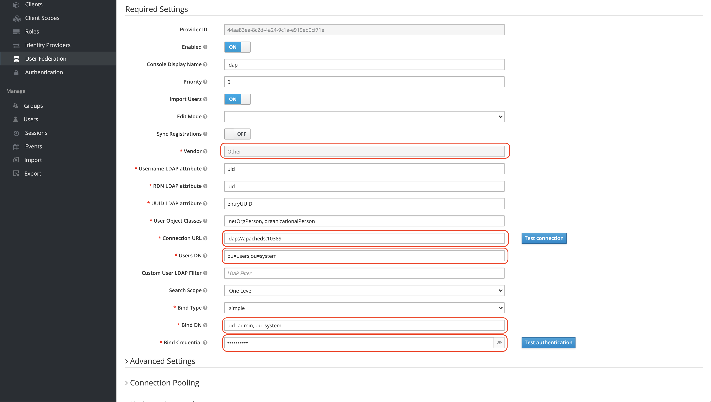

The following parameters are important to be set, as we use ApacheDS (and the default values within the applied image):
- Connection URL = `ldap://apacheds:10389"` (be aware that you need to use the service name as described in docker-compose)
- User DN = `ou=users,ou=system`
- Bind DN = `uid=admin, ou=system`
- Bind Credential = `secret`

## Add Group Mapper
To ensure that your users are assigned to the appropriate groups you have to add a group mapper:
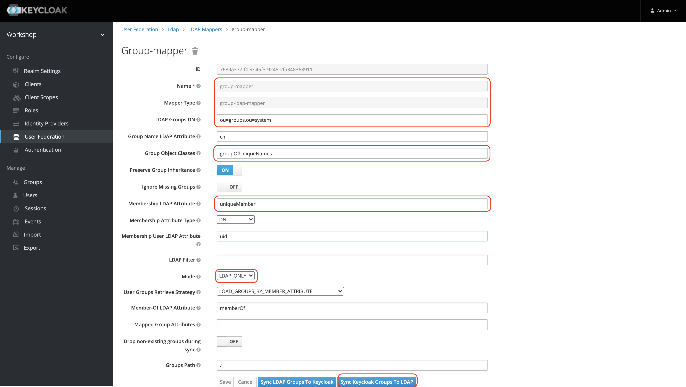

The following values have to be adapted due to use of ApacheDS:
- LDAP Groups DN = `ou=groups,ou=system`
- Mapper type = `group-ldap-mapper` (selection from predefined values)
- Group Object Classes = `groupOfUniqueNames`
- Membership LDAP Attribute = `uniqueMember`
- Mode = `LDAP_ONLY`

Finally you can `Sync Keycloak Groups To LDAP`.

## Add Role Mapper
Furthermore roles have to be assigned properly as well:
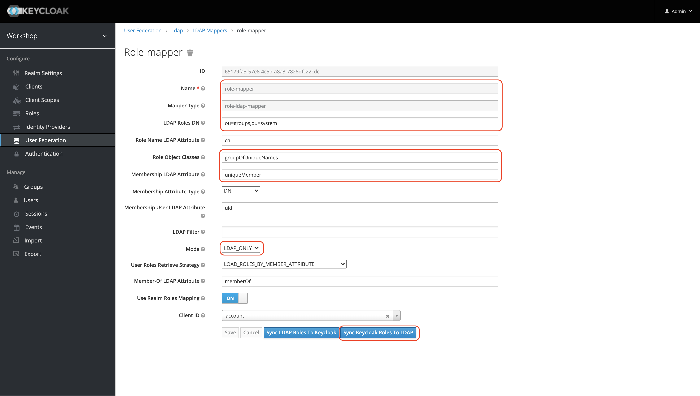

**In our case we assume groups and roles to be the same!**

The following values have to be adapted due to use of ApacheDS:
- Name = `role-mapper`
- Mapper Type = `role-ldap-mapper` (selection from predefined values)
- LDAP Roles DN = `ou=groups,ou=system`
- Role Object Classes = `groupOfUniqueNames`
- Membership LDAP Attribute = `uniqueMember`
- Mode = `LDAP_ONLY`

Again you can `Sync Keycloak Roles To LDAP`.

## Synchronize/ Clean-up

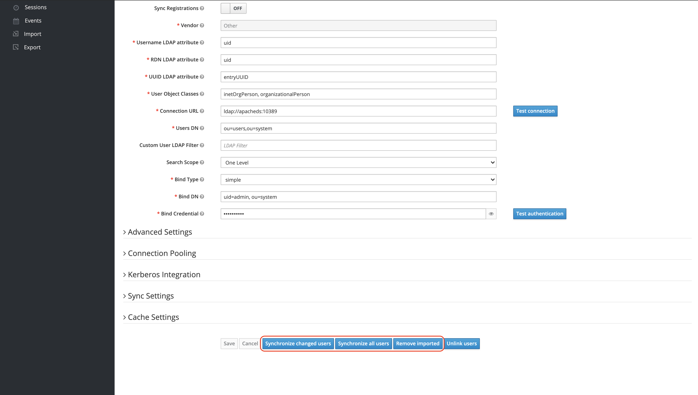

On the concrete user federation you can finally synchronize:
- only the changed users
- all users

Additionally you can clean up by:
- removing all imported

Now using [Apache Directory Studio](https://directory.apache.org/studio/) you can see (and modify) your LDAP entries:

1. First of all you have to add a new connection to your localhost. This time we do not use "apacheds" as you access
   the system from your host system (and thus the port is already exported).
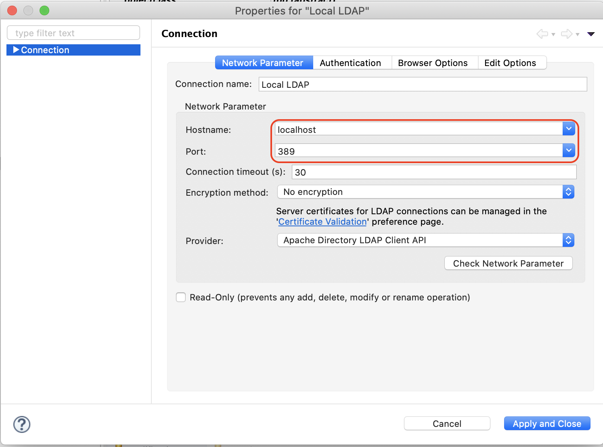

1. As credentials use the DN of the admin user `uid=admin,ou=system` and the default password `secret`.
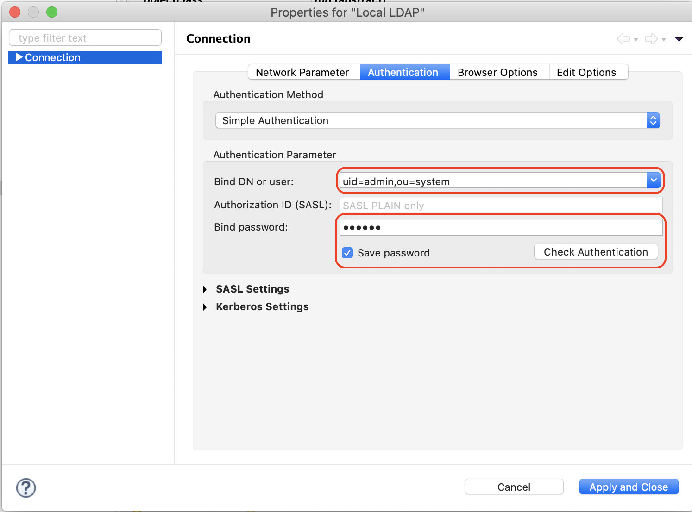

1. No create a new user "Tony Stark", change his password to "stark":
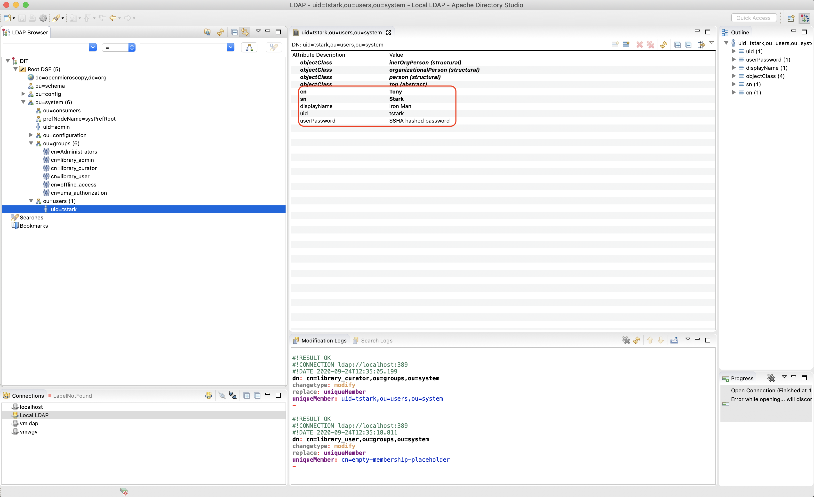

1. Finally you can assign this new user to the `library_curator` group:
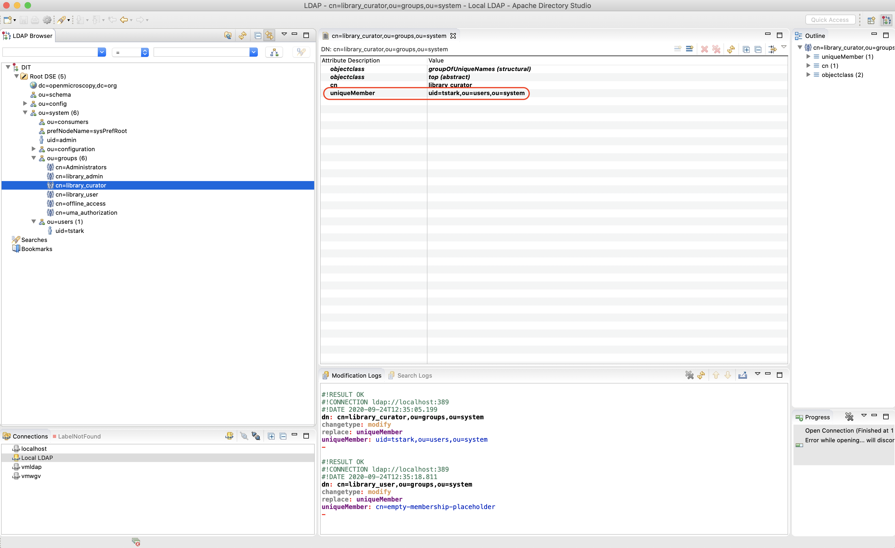

Finally, you can again remove/ synch in keycloak, and your new user should exist in teh correct groups/ roles:
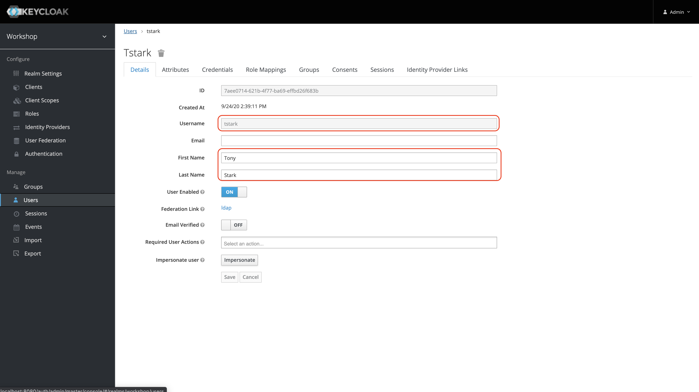

The role should be the same as provided in LDAP:
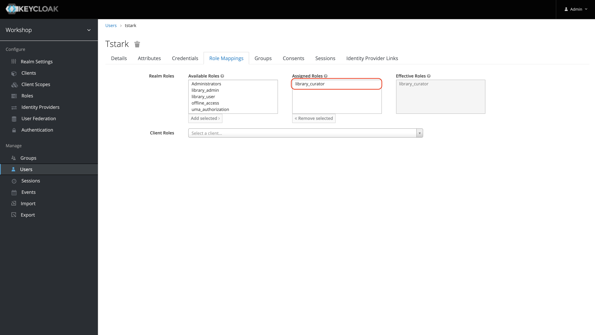

The group should also  be the same as provided in LDAP:
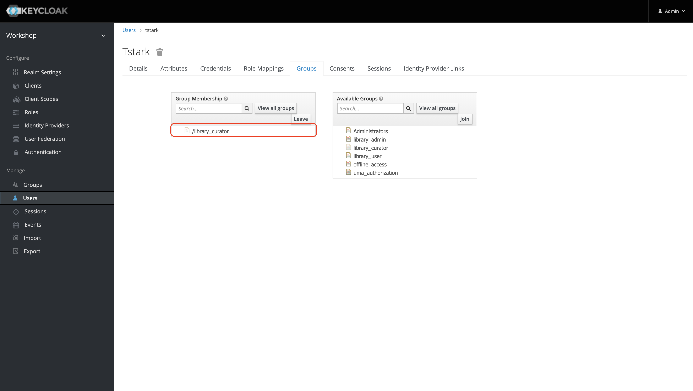
